# 微信开发实战（PHP 版）

**提及微信，大多数人会想到朋友圈、微信红包。那么其他的呢？下面，我们将会用两张图片，让大家了解下微信的现状及微信的应用有哪些？**

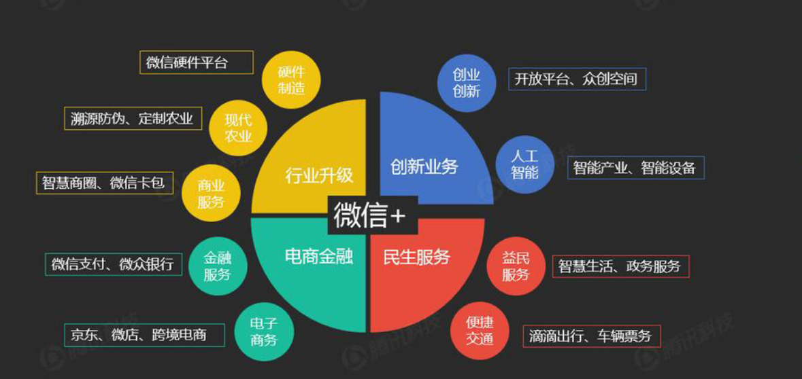

通过这两张最新的分析报告，我们不难发现，支付、公众号、卡券、电商、红包，这些关键词无疑是微信的重点。
基于目前很缺少快速上手的微信开发实战课程，极客学院将于近期推出此系列课程。突出实战和效率，让不同岗位的朋友们快速上手，学习开发。(PS:销售不懂技术的苦，这里将会有答案)

### 课程大纲

### 开发环境搭建

**不喜欢折腾的同学可以使用打包好的vagrant环境，详见：<http://git.jikexueyuan.com/timjuly/vagrant-lnmp>**

#### 第一步，安装虚拟机软件 Virtualbox

下载地址:<https://www.virtualbox.org/wiki/Downloads>

>注意：选择对应的操作系统下载，安装步骤简单，只需要下一步至结束即可，安装完后，重启电脑。

#### 第二步，下载 CentOS 系统

>注意，下载 Minimal ISO 版本，大小 603 MB

下载地址:<https://www.centos.org/download/>

#### 第三步，配置虚拟机

打开 Virtualbox 

选择->新建

1. 新建虚拟电脑，填完信息后，点击“继续”
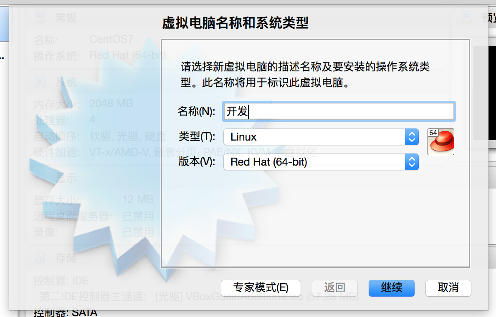
2. 分配内容大小
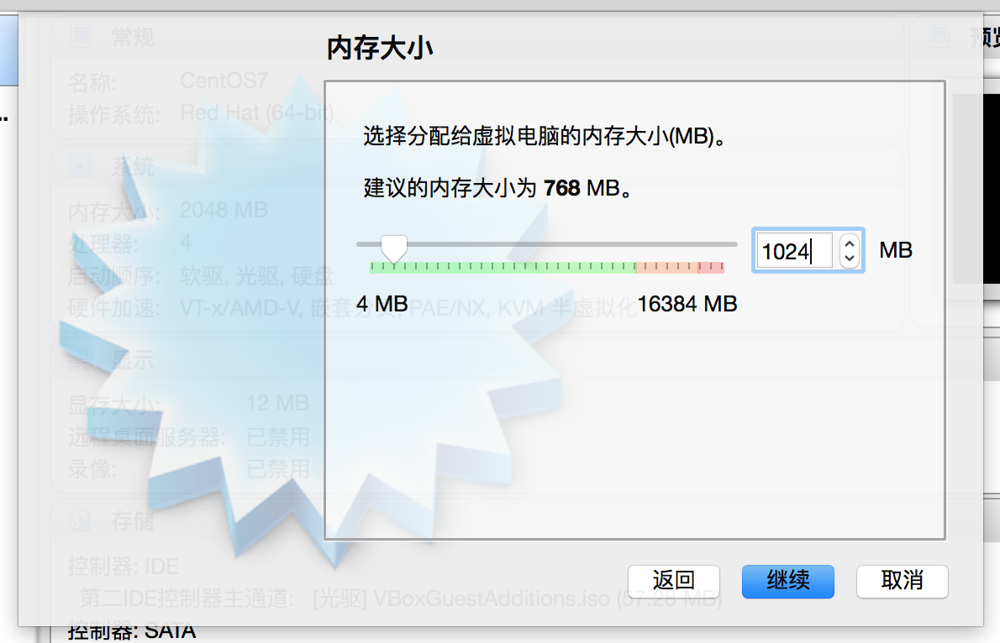
3. 创建虚拟硬盘
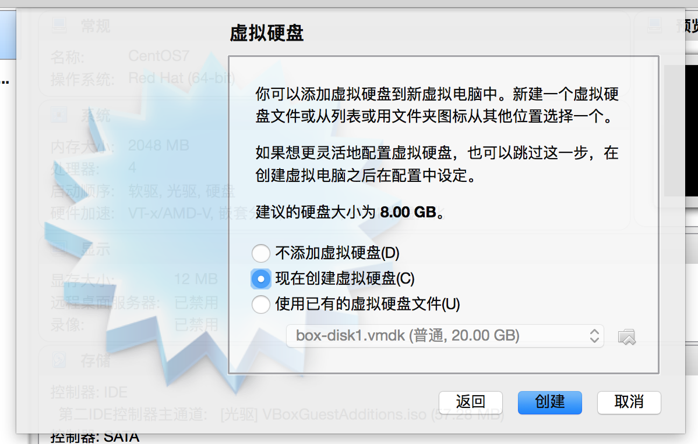
4. 选择文件大小
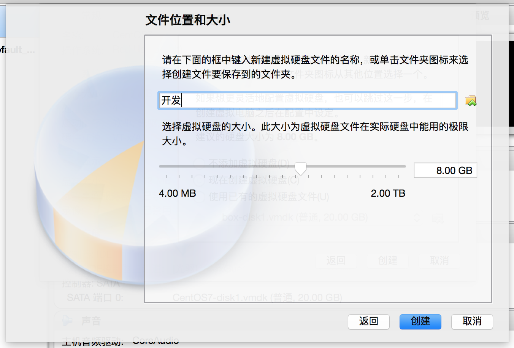
5. 配置虚拟机路径
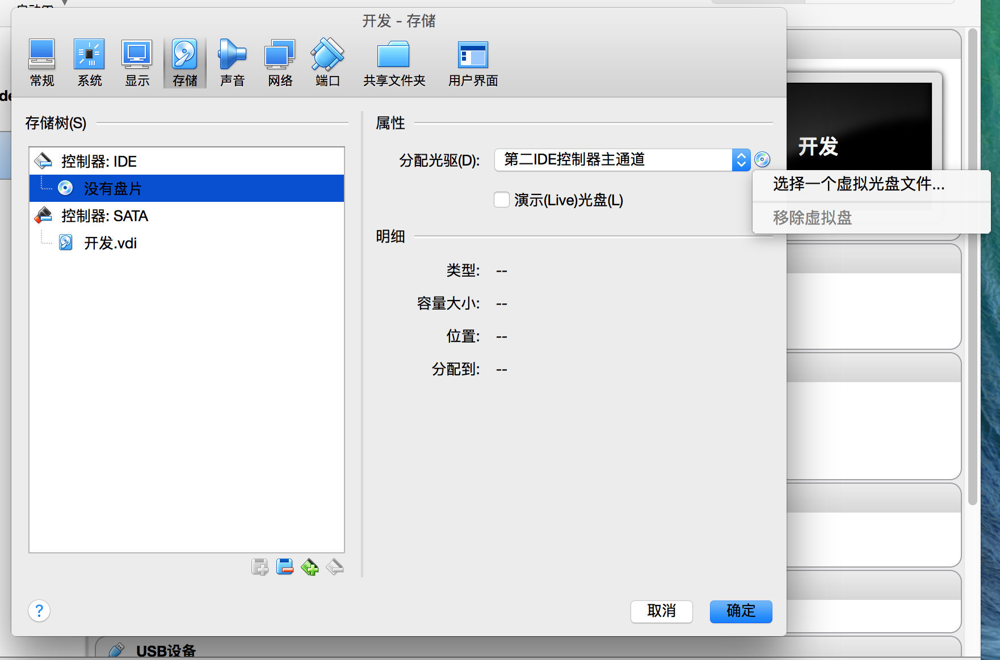

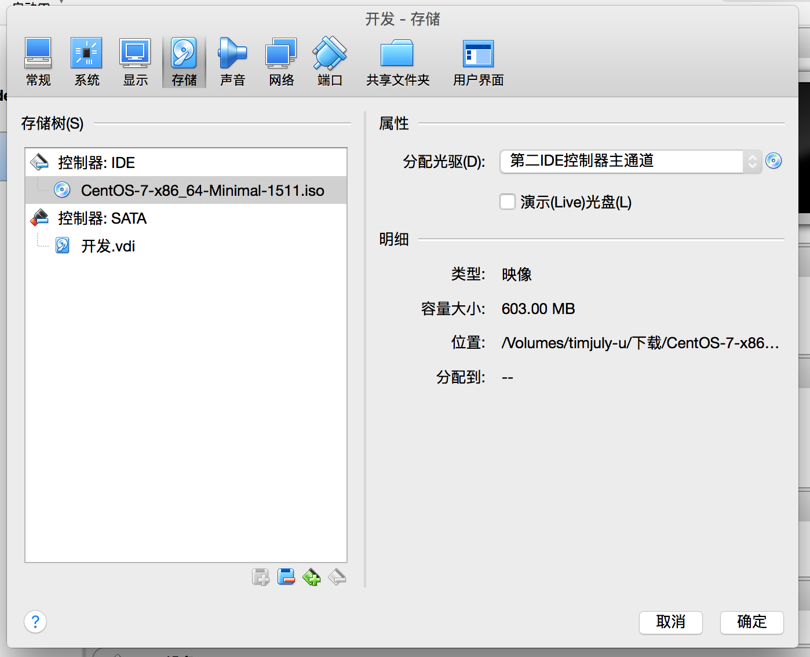
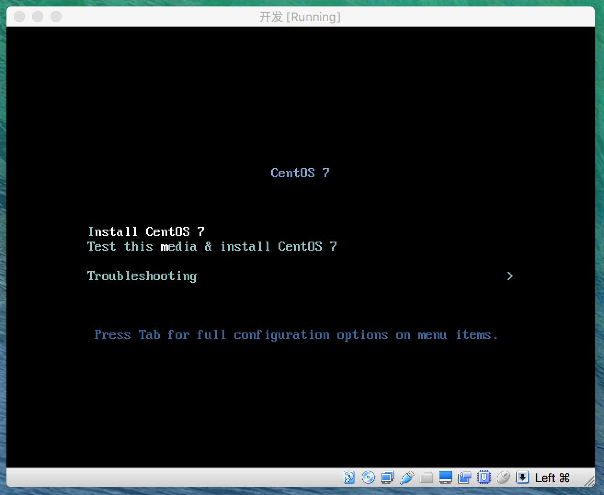
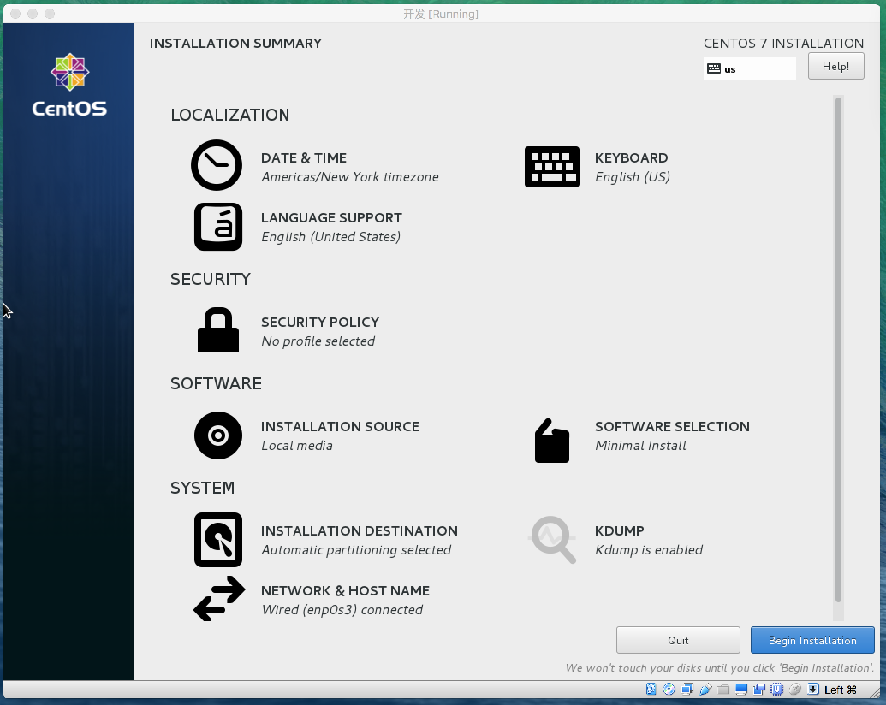
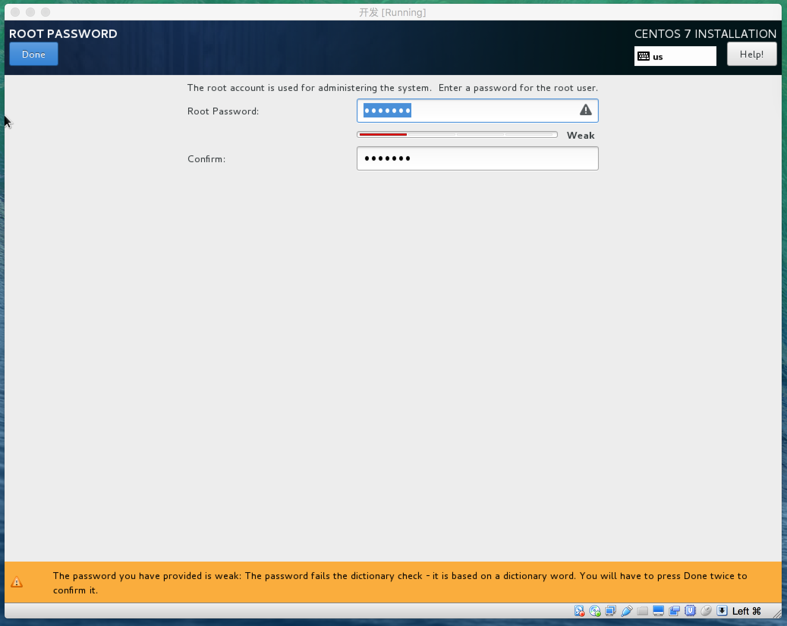
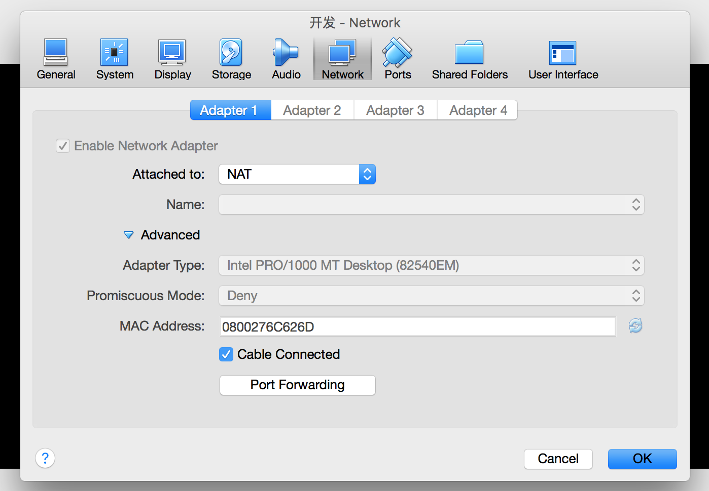
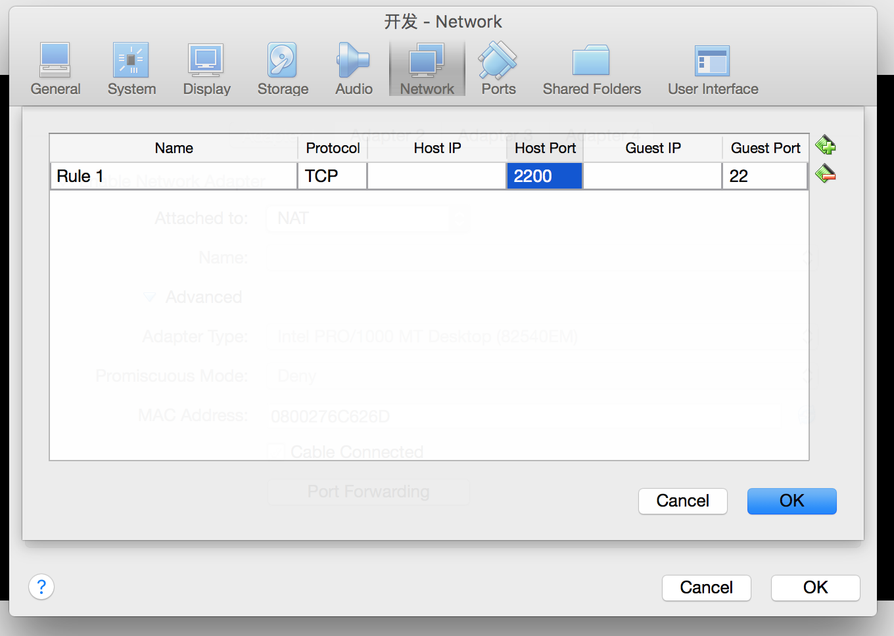
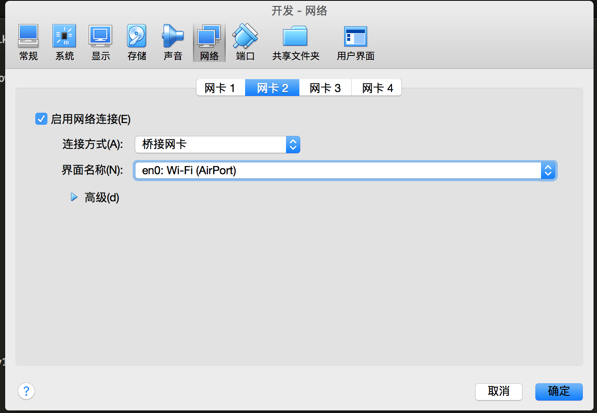
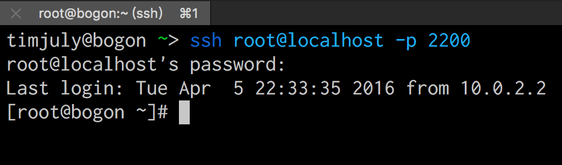
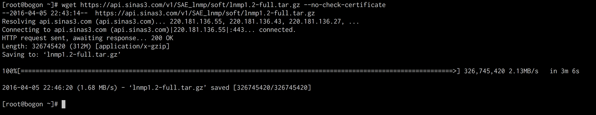
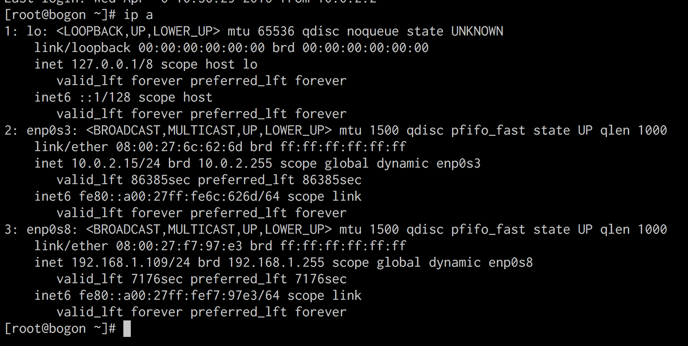
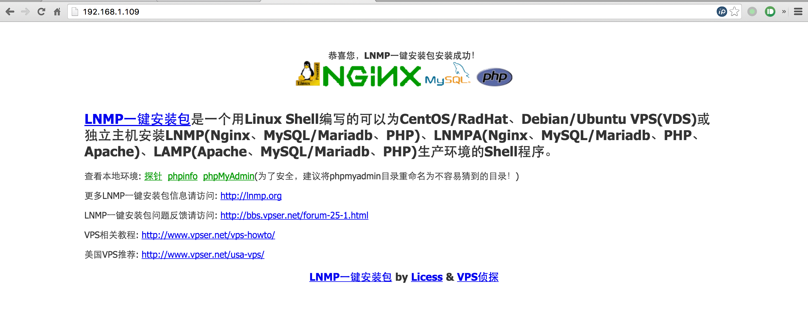

>如果你的Virtualbox打不开，请按这两种方式尝试解决：<http://www.xuenb.com/app/2014080930.html>

### 课前准备

- [PHP 基础教程（精简版）](http://wiki.jikexueyuan.com/project/php-basics-notes/)建议没有PHP基础的人员阅读，此图文课程能够让你对PHP 有一个初步了解，这是跟老师做实际操作的基础。
